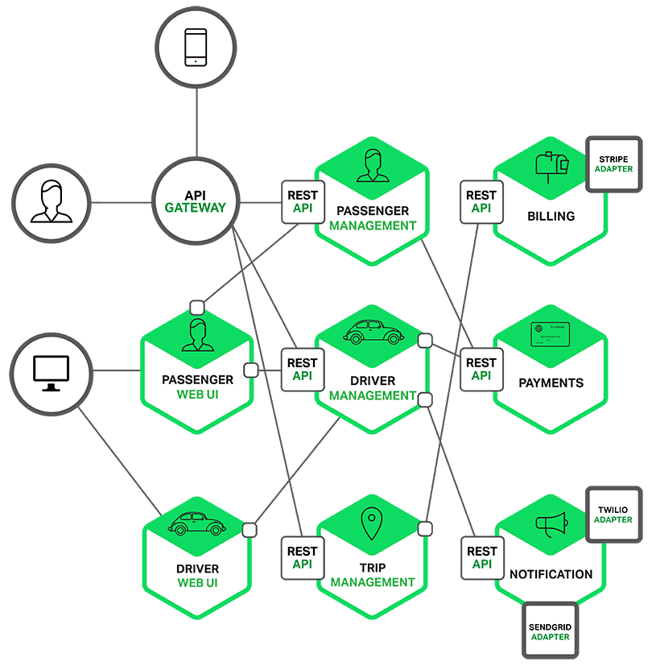

## 🧑‍🌾 소상공인을 위한 동반자, 소동 BE 🧑‍🌾
- 이 레포지토리는 소동 Backend Server의 FastAPI Server입니다.   
- [Spring Boot Server의 레포지토리로 이동합니다.](https://github.com/goormthon-Univ/2024_BEOTKKOTTHON_TEAM_27_BE_1)

### 💻 실행 방법
(실행하고자 하는 서버의 폴더 내에서 다음의 명령어 실행)  
```
cd gpt
uvicorn main:app --reload --port=8000

cd posting
uvicorn main:app --reload --port=8001

cd storage
uvicorn main:app --reload --port=8002
```

### 🐳 CI/CD 파이프라임
- 도커 이미지 빌드
```
docker build -t gpt-image:latest . -f gpt.Dockerfile
docker build -t posting-image:latest . -f posting.Dockerfile
docker build -t storage-image:latest . -f storage.Dockerfile

docker run \
    -p 8000:8000 \
    -e REST_API_KEY="$REST_API_KEY" \
    -e MAX_TOKENS="$MAX_TOKENS" \
    -e TEMPERATURE="$TEMPERATURE" \
    -e TOP_P="$TOP_P" \
    -e N="$N" \
    -e OPENAI_KEY="$OPENAI_KEY" \
    gpt-image:latest

 docker run \     
    -p 8001:8001 \
    -e BASE_URL="$BASE_URL" \
    -e GPT_PORT="$GPT_PORT" \
    -e POSTING_PORT="$POSTING_PORT" \
    -e STORAGE_PORT="$STORAGE_PORT" \
    -e KOGPT_API="$KOGPT_API" \
    -e CHATGPT_API="$CHATGPT_API" \
    posting-image:latest

docker run \
     -p 8002:8002 \
     -e IBM_API_KEY=${IBM_API_KEY} \
     -e IBM_CLOUD_URL=${IBM_CLOUD_URL} \
     -e IBM_TOKEN_URL=${IBM_TOKEN_URL} \
     -e BUCKET_NAME=${BUCKET_NAME} \
     -e BASE_URL=${BASE_URL} \
     -e GPT_PORT=${GPT_PORT} \
     -e POSTING_PORT=${POSTING_PORT} \
     -e STORAGE_PORT=${STORAGE_PORT} \
     storage-image:latest
```

### ❗️핵심 기능
- **Microservice Architecture**
  - Micro Service Architecture로 구현
  - 이미지를 편집하는 라이브러리인 Pillow를 사용하기 위해서 파이썬 언어의 서버 필요
  - Spring과 FastAPI의 장점 극대화
  - 개발 및 유지 보수의 강점


- **최적의 GPT 프롬프터 실험**
  - 타겟, SNS 채널 혹은 결과 타입에 따른 프롬프터 분리
  - 타겟 및 SNS 채널에 따른 프롬프터 예시 차별
  - 정확한 예시를 위한 공식 문서 참조
    - https://dangolmarket.campaign.kakao.com/education/24?recommend=2
    - https://mystore.kakao.com/m/notice

- **이미지와 글자 편집 기능**
  - 특정 글꼴을 사용하여 글씨의 이중 바깥 테두리 구현
    - 글꼴: [삼립호빵체](https://spcsamlip.co.kr/sandoll-samlip-hopang/)
  - 글자수에 따른 글씨 크기 자동 조절  

| 기능 구현 전 | 기능 구현 후 |
|---------|---------|
|    |         |

  - 글자 크기에 따른 글자 위치 자동 조절
  - 이미지의 우측 상단에 로고 삽입
  - 글자 크기 구하기 ([PIL 라이브러리](https://pypi.org/project/pillow/) 이용 X)
    - 버전 업그레이드에 따른 메소드 삭제
  - 일정한 글자 삽입을 위한 사용자 이미지 크기 조절


### ⌨️ 백엔드 기술 스택
| 역할              | 종류                           |
|-----------------|------------------------------|
| **Framework**       | Spring Boot, Spring, FastAPI |
| **Database**        | MySQL                        |
| **Server**          | Oracle, Certbot              |
| **Language**        | Java, Python                 |
| **API**             | REST                         |
| **Version** **Control** | Git, Github                  |
| **Communication**   | Discord, Notion              |

### 🖇️ API 명세서


### ⚙️ 인프라


### 🧚🏻 팀원 소개
| 양채린                                         | 정찬호                                     |
|---------------------------------------------|-----------------------------------------|
| 사진                                          | 사진                                      |
| [chaeeerish](https://github.com/chaeeerish) | [chjung99](https://github.com/chjung99) |
| 경기대학교 미르미                                   | 세종대학교 미르미                               |
